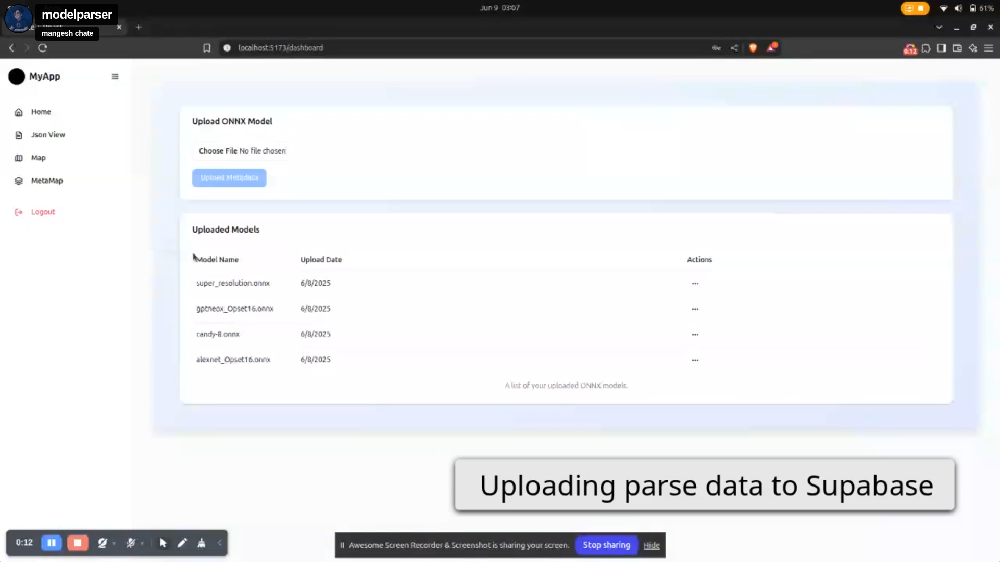

# Model Data Visualization Dashboard

A concise full-stack app for model management with upload, display, and deletion features. It visualizes parsed data on a dashboard using Recharts, focusing on Operator Distribution, Input vs Output, complexity metrics, and layer details. The app employs Canvas for 2D and Three.js for 3D rendering.

# Dashboard Screenshots

Below are some screenshots of our dashboard:

### Screenshot 1

    

### Screenshot 2

    

### Screenshot 3

    

### Screenshot 4

    

### Screenshot 5

    

## Features

- **Model Management**
  - Upload models (various formats supported)
  - View model details in tabular format
  - Delete/download models
  - Client-side data parsing

- **Interactive Visualizations**
  - Operator distribution charts
  - Input vs output comparisons
  - Complexity metrics analysis
  - Layer details exploration
  - 2D Canvas rendering
  - Three.js 3D model visualization

- **Data Processing**
  - Client-side data filtering
  - Optimized metadata transfer
  - Efficient database storage

- **Screenshot Feature**
  - Capture screenshots of visualizations and dashboards

## Technology Stack

**Frontend**:
- Vite + React
- Tailwind CSS
- shadcn/ui components
- Recharts (dashboard visualizations)
- Three.js (3D rendering)
- Canvas (2D visualization)

**Backend**:
- Flask (Python)
- JWT Authentication
- Supabase (PostgreSQL database)

## Optimization Highlights

✔ Client-side data parsing reduces server load
✔ Selective metadata storage minimizes database usage
✔ Efficient filtering system for responsive visualizations
✔ Discovered TensorSpace for advanced model visualization
